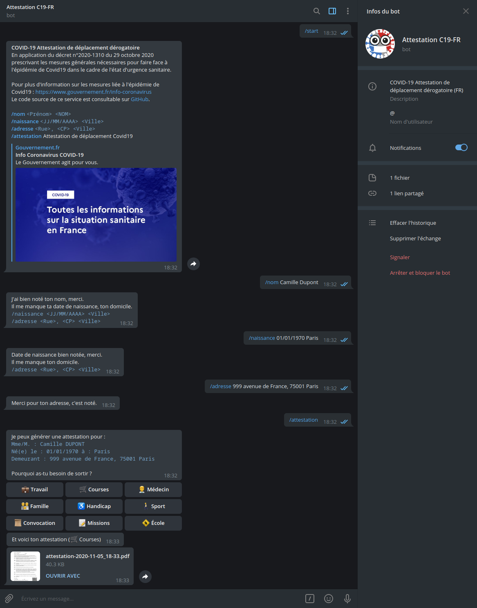

# Bot Telegram générateur de certificat de déplacement

**C19-FR-Bot** est un Bot Telegram permettant de générer l'attestation de déplacement requise en période de confinement et couvre-feu en France.

Il est basé sur le projet officiel de générateur de certificat de déplacement :

- https://github.com/LAB-MI/attestation-deplacement-derogatoire-covid-19
- https://media.interieur.gouv.fr/attestation-deplacement-derogatoire-covid-19/

## Installation

Vous devez héberger le service vous-même. Pour cela, il vous faut d'abord créer un _bot_ Telegram en envoyant simplement un message à [@BotFather](https://core.telegram.org/bots#6-botfather).

En créant un bot, @BotFather vous donnera un jeton qui est nécessaire pour autoriser le _bot_ et envoyer des requêtes à l'[API](https://core.telegram.org/bots/api) Telegram. Gardez votre jeton et stockez-le en toute sécurité, il peut être utilisé par n'importe qui pour contrôler votre _bot_.

Ensuite, télécharger ce projet, configurer le _bot_ avec votre jeton et démarrer le container _Docker_ (vous devez avoir installé [docker](https://docs.docker.com/engine/install/) et [docker-compose](https://docs.docker.com/compose/install/)) :

```bash
git clone https://github.com/vonKrafft/Telegram-C19-FR-Bot
cd Telegram-C19-FR-Bot
sed -i 's/0123456789:ABCDEFGHIJKLMNOPQRSTUVWXYZ123456789/<votre_jeton_Telegram>/' docker-compose.yml
docker-compose up -d
```

Il est également possible de **limiter l'accès aux commandes du bot** à certains utilisateurs sur la base d'une liste blanche. Pour cela, renseigner les ID des comptes Telegram autorisés (séparé par des virgules) dans la variable `WHITELIST` dans le fichier `docker-compose.yml` (si cette variable est vide, aucun filtrage ne sera appliqué).

Une fois le container démarré, vous pouvez envoyer des message à votre _bot_, si tout s'est bien passé il devrait vous répondre.

## Utilisation

En plus des commandes natives de Telegram (`/start`, `/help` et `/settings`), les commandes disponibles sont les suivantes :

- Renseigner ses informations pour remplir l'attestation :
    - `/nom <Prénom> <NOM>` ;
    - `/naissance <JJ/MM/AAAA> <Ville>` ;
    - `/adresse <Rue>, <CP> <Ville>` ;
-  Génération de l'attestation de déplacement Covid19 : `/attestation`.

Une fois les informations renseignées, le _bot_ gardera en mémoire pour chaque compte Telegram le nom, la date de naissance et l'adresse. L'utilisateur aura simplement besoin d'utiliser la commande `/attestation` et sélectionner son motif de sortie pour obtenir une attestation.



